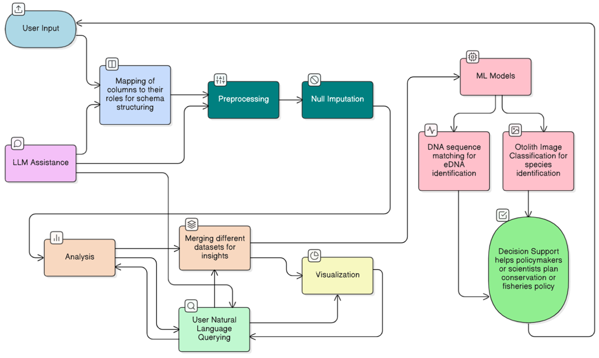

# OceanPilot AI: AI-Driven Marine Data Platform

**OceanPilot AI** is a web-based, cloud-ready platform designed to solve a critical data challenge for the Centre for Marine Living Resources & Ecology (CMLRE). It ingests, processes, and analyzes complex, heterogeneous marine datasets, turning siloed information into actionable, cross-disciplinary insights for scientists and policymakers.

This project was developed for the **Smart India Hackathon 2025**.

[Demo of Data Analysis](https://www.youtube.com/watch?v=Kav7omrEyFk&t=142s)


## The Problem

Marine scientists at CMLRE work with diverse datasets—oceanography, fisheries, and molecular biology—that are stored in different formats and siloed systems. This fragmentation makes integrated analysis, real-time visualization, and advanced analytics nearly impossible, creating a major bottleneck for critical research on ecosystem conservation and fisheries management

## The Solution

OceanPilot AI provides a unified platform that automates the entire data lifecycle. It leverages an LLM-powered assistant to make complex data interaction intuitive for non-expert users, enabling deep analysis and visualization through natural language.

### Key Features

* **Automated Data Ingestion & Preprocessing:** Users can upload diverse raw data files (e.g., `.gz`, `.csv`). The platform automatically processes them, provides a data quality summary, and handles null values, preparing the data for analysis.


* **LLM-Powered Co-Pilot:** An integrated AI assistant helps users at every step, from providing automated data summaries to suggesting intelligent schema mappings for new datasets.

* **Dynamic, Agent-Driven Analysis:** Users can query the data using natural language or select pre-defined analyses. An AI agent interprets these requests to generate complex visualizations on-demand, such as Temperature vs. Depth profiles and T-S (Temperature-Salinity) diagrams.

## Technical Architecture

The platform is built on a modern, scalable tech stack designed for real-time data processing and interactive user experiences.


*(High-level workflow of the OceanPilot AI platform)*

### Tech Stack

* **Backend:** **FastAPI** , **LangChain** (for LLM orchestration and agents) , **Pandas** (for data handling).
* **Frontend:** **React.js** (for a dynamic and responsive UI).
* **Database:** **Supabase** (for storing datasets and session metadata).
* **Real-time Communication:** **WebSockets** (for live updates between the frontend and backend during analysis).

## Setup & Installation

To run this project locally, follow these steps:

1.  **Clone the repository:**
    ```bash
    git clone https://github.com/IOutis/OceanPilotAI.git
    ```
2. **Env File Structure:**
    Create a .env file
    ```
    GEMINI_API_KEY=*********
    ```
3.  **Set up the backend:**
    
    ```bash
    python -m venv venv
    source venv/bin/activate
    pip install -r requirements.txt
    uvicorn backend.main:app --reload
    ```
    
